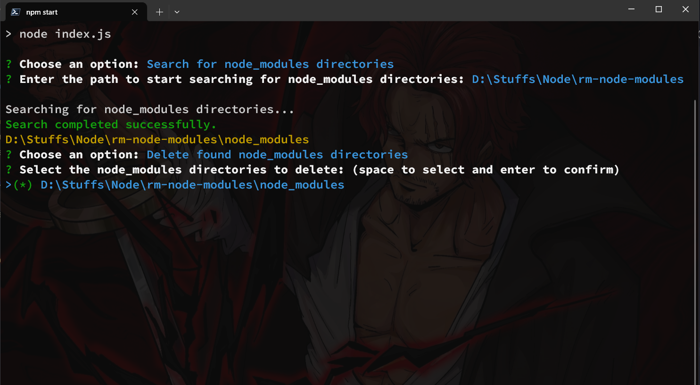

# `node_modules` Cleaner



## Description

An easy way to clean all the `node_modules` folders in your projects. This script will search and delete all the selected `node_modules` folders in the current directory/ path provided by user and all its the subdirectories.
An alternative to npkill.

## Usage

1. Clone the repository

   ```bash
       git clone https://github.com/i-m-afk/Node-Modules-Cleaner
   ```

2. cd Node-Modules-Cleaner
3. Run `npm install` or `npm i` to install the dependencies
4. Run `npm start` to start the script
5. Go to search and input the directory you want to search in (e.g. D://Projects)
6. Wait for the script to finish searching
7. Use `space` to select and `enter` to confirm the folders to delete
